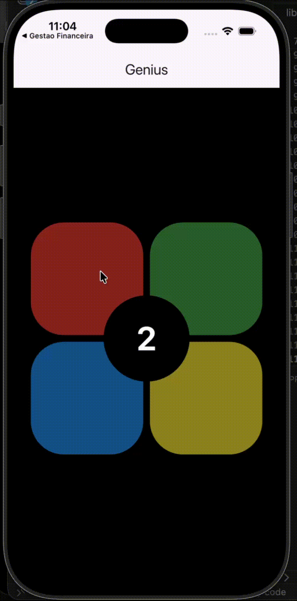
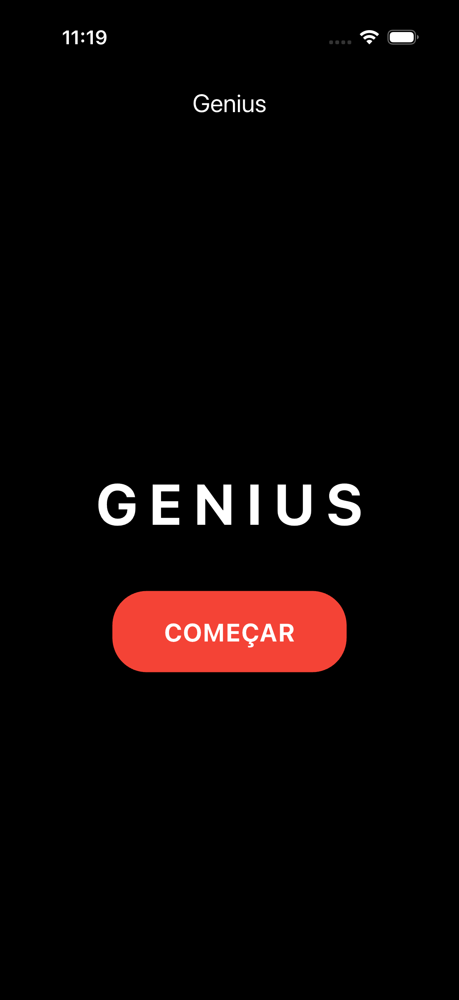
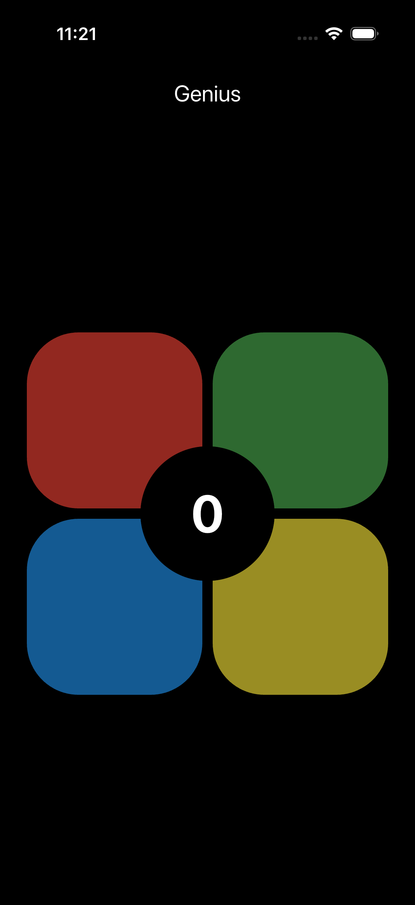
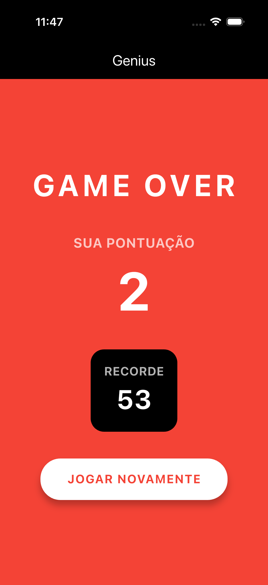

# Genius

Um jogo inspirado no clássico Genius, desenvolvido em Flutter durante um encontro presencial da Lince.

## Demonstração

## Screenshots

| Tela inicial | Durante o jogo | Game Over |
|---|---|---|
|  |  |  |

## Funcionalidades
Sistema de sequência progressiva de cores
Efeitos sonoros diferentes para cada cor
Validação dos comandos do jogador
Feedback visual dos botões
Sistema de pontuação
Sistema de recorde com persistência local
Tela de Game Over
Reprodução automática da sequência
Gerenciamento de estado com Provider

## Tecnologias

- Flutter
- Dart
- Provider
- SharedPreferences
- audioplayers

## Conceitos praticados

- ChangeNotifier
- Provider
- async/await
- Future.delayed
- enum
- Map
- Gerenciamento de estado
- Persistência local
- Componentização de widgets
- Reprodução de áudio
- Organização de assets

## Estrutura de Assets

assets/
├── images/
│   ├── inicio.png
│   ├── jogo.png
│   └── game_over.png
│
├── gifs/
│   └── gameplay.gif
│
└── sounds/
    ├── soundR.wav
    ├── soundG.wav
    ├── soundB.wav
    └── soundY.wav
